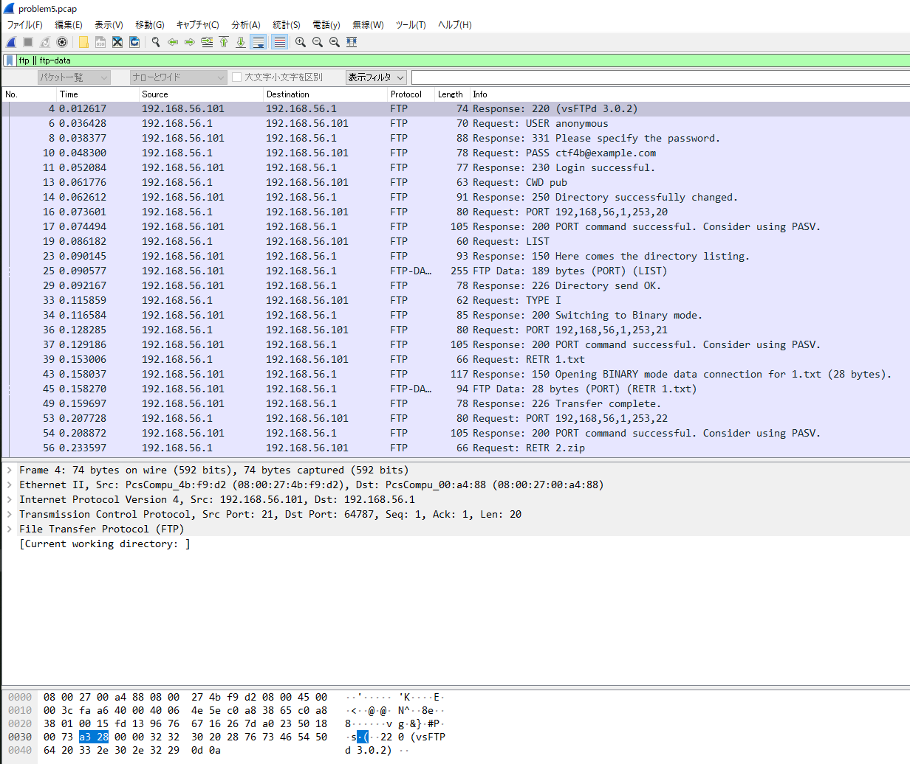
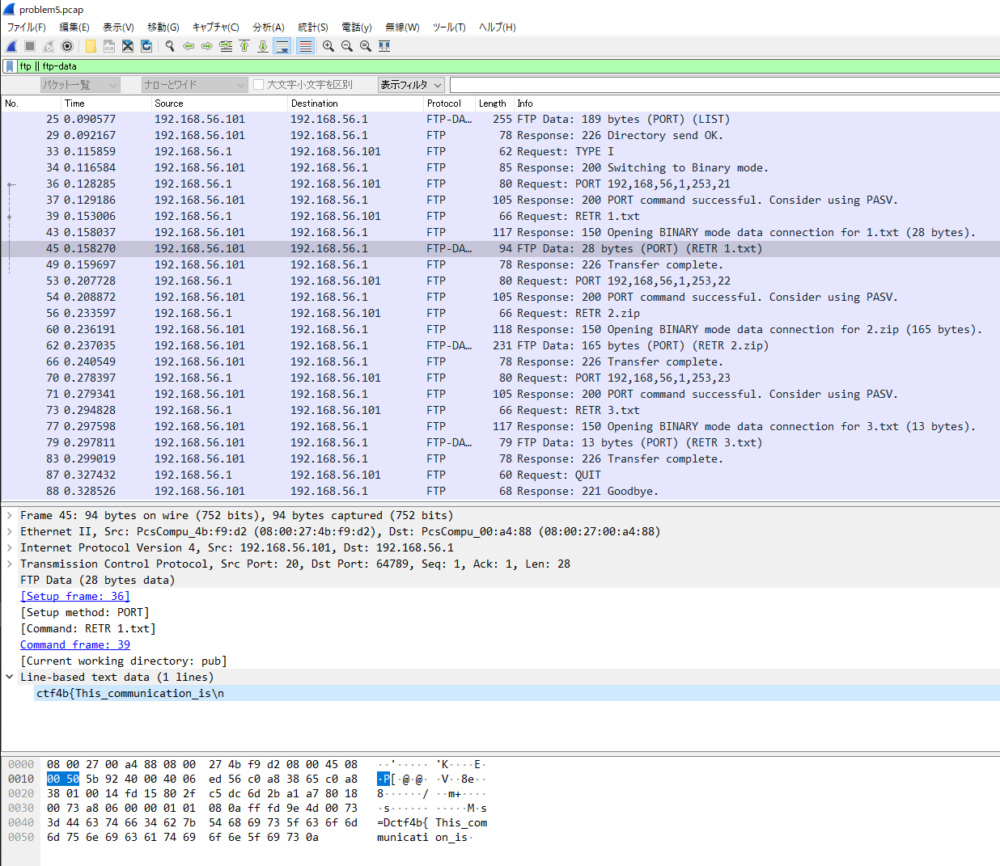
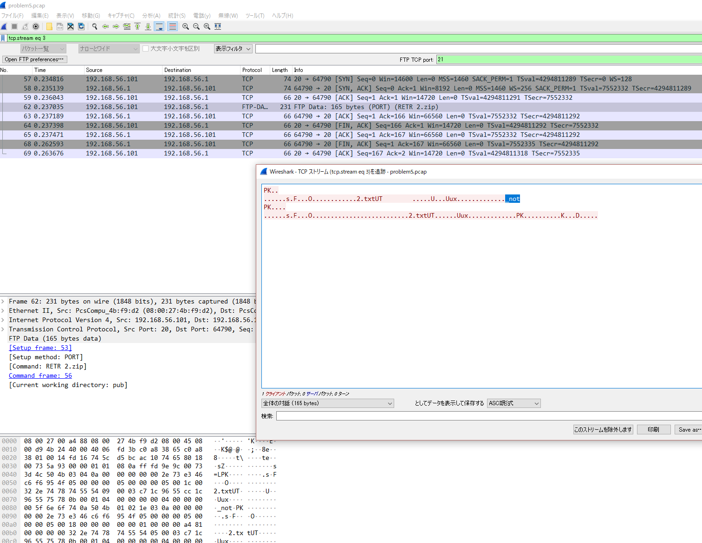

2019/6/26　
> # ネットワークジャンル（パケット解析）
### 「CTF for ビギナーズ2015年演習」

参考サイトURL：[https://book.mynavi.jp/manatee/detail/id=64023](https://book.mynavi.jp/manatee/detail/id=64023)

問題ファイルはこちら：[problem5.pcap](attach:problem5.pcap)（クリックor右クリックでダウンロードできます）

ファイルはzip形式になっているので解凍してWireSharkでファイルを開いてみよう 

※WireSharkのダウロードはこちら：[https://www.wireshark.org/download.html](https://www.wireshark.org/download.html)

----

### WireSharkで開いてみるとこのような図1.の画面になります。

図1．wiresharkに表示される画面

この画面では記録されているパケットを一覧で表示しているPacketList（画像上段）、パケットの詳細情報を表示するPacketDatails（画面中段）、記録されているデータをバイナリエディタのように表示するPacketBytes（画像下段）、とこの3段で構成されている。

 > # パケットの解析

 WireSharkでファイルが開けたら早速解析をしていこう

- 調べる場所の目星をつける
- 必要な（視たい）パケとを表示する
- 絞ったなかで解析（中身をみていく）していく

> ## 調べる場所の目星をつける

WireSharkのPacketListの画面でいくつかパケットを見てみるとProtcolの部分でFTPがみつけることができる。

※FTPとは...

    「サーバとクライアント間でネットワークを通じてファイルを転送する時に使われるアプリケーション層のプロトコル」

頻繁に利用されているFTPだが設定によってはユーザ名やパスワードの認証情報、転送しているファイルなど暗号化されないままクライアントとサーバ間で送受信が行われる。

今回も例外ではなく、FTPパケットは暗号化されていないのでパケットキャプチャによって通信内容を見ることが出来ます。

では見ていきましょう。

> ## パケットをフィルタリングする（絞り込み）

通常のパケット表示のままでは自分が見たいもの以外のパケットも表示されていて見づらいことがあるので、WireSharkのフィルタリング機能「Display Filter」を使用してFTPに関連するパケットのみを表示させます。 
解析画面の上部テキストボックスに条件文を入力していきます。

    FTP:「ftpの制御用通信」をフィルタリング
    FTP-DATA:「FTPのデータ用通信」をフィルタリング

 

図2.フィルタリング後の画面
 

FTPとFTP-DATAの両方でフィルタリングをするのでOR演算子を使い 
`ftp || ftp-data`と入力してフィルタリングをかけます。
フィルタの構文を適切に適用されると入力部のテキストボックス背景色が緑色になり、右側にある矢印ボタンを押すとフィルタリングされます。

 

> ## 絞り込んだパケットを解析していく

FTPであれば**Packet List**の**Info**にある **Response**の列にサーバとの通信内容が表示されます。この部分を１つずつ見ていくと**Request**と**Response**の2種類があります。**Request**ではクライアントからサーバーへ送信した要求（コマンド）を表示し**Response**ではコマンドを実行した結果(レスポンスコードとメッセージ)を表示します。

FTP通信を解析にするには、表示されているコマンドを理解する必要があります。今回使われているコマンドを見てみよう

    USER：usename　[パラメータで指定したユーザ名でFTPサーバにログインする]
    PASS：password　[USERコマンドで指定したユーザ認証に使用するパスワードを送信]
    CWD ：directory path　[パラメータで指定したpathに作業ディレクトリを移動]
    PORT：h1,h2,h3,p1,p2　[パッシブモードで使用するIPアドレス(h1~h5)ポート番号(p1~p2)を指定]
    LSIT：directory path　[パラメータで指定したpathにあるディレクトリファイルの一覧を表示]
    PETR：file path　[pathで指定したアフィルをサーバからダウンロード]
    QUIT：- [FTPサーバからログアウトしてコネクションを切断]

## このコマンドを理解しながら表示されたパケットを見ていくと次のような操作をしていることがわかる

    1. FTPサーバにユーザー名：anonymous、パスワード：ctf4b@example.comでログイン
    2. pubをカレントディレクトリに設定 
    3. カレントディレクトリ内のファイル・ディレクトリ一覧を取得
    4. 1.txt,2.zip,3.txtというファイルをダウンロード
    5. 通信を切断

通信を切断するまでに3つのファイルをダウンロードしているのがわかります。
まだFLAGらしきものがなかったのでこのファイルの中にFLAGに繋がるものがありそうですね。

> # ファイルの中身を調べる

先ほど記述した通りFTP通信は制御用（FTP）とデータ用（FTP-DATA）に接続が分かれています。ファイル本体はファイルダウンロードコマンド（RETR）の直後、データ用で接続されているのでそのパケットを探してみましょう。

# 「1.txt」

図３の画面でprotcolのFTP-DATAにある1.txtがダウンロードされている場所をみてみるとPacket Datailsの`Line-based text data`の中に`ctf4b{This_communication_is\n}`とFLAGが見つかりました！

 

図3. 1.txtのFLAG

# 「2.zip」

 

続いて2.zipを同じように見てみよう。だが1.txtのようにはいかずDATAの中には`response bytes: 165`とデータサイ
ズのみしか書かれていない。これではファイルの中身が見れません。 
このファイルの中身をも見るためにWireSharkの機能である**Follow TCP Stream**を使います。 
これは選択したTCPセッションで送受信しているデータをまとめて表示する機能です。 
2.zipが含まれるパケットを右クリックして**追跡**から**TCPストリーム**を選択すると図４のような画面が表示されます。

 

図4.　2.zipのFLAG

TCPストリームを使った後の画面を見てみると2行目最後に`_not`とFLAGらしき文字列をみつけることができます。

「3.txt」

